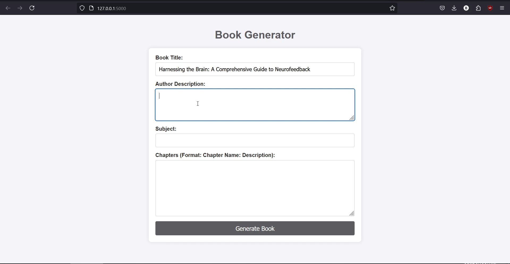

# BookWriter App

This application allows you to generate text using either OpenAI's GPT API or the locally hosted LLaMA model. Follow the instructions below to set up the environment and run the app.

## Table of Contents
- [Requirements](#requirements)
- [Environment Setup](#environment-setup)
- [Using GPT API](#using-gpt-api)
- [Using LLaMA Local Model](#using-llama-local-model)
- [Running the Application](#running-the-application)

## Requirements

Make sure you have the following installed:
- Python 3.8 or higher
- `pip` for managing Python packages
- A virtual environment setup tool (`venv` or `conda`)
- Access to the [OpenAI API](https://beta.openai.com/signup/) if using GPT, or download the [LLaMA model](https://huggingface.co/meta-llama/Meta-Llama-3.1-8B) for local usage.

## Environment Setup

1. Clone the repository:
   ```bash
   git clone https://github.com/Xer0bit/BookWriter-Lamma3.1-OPENAI.git
   cd BookWriter-Lamma3.1-OPENAI


2. Create a virtual environment:
   ```bash
   python -m venv venv

3. Activate the virtual environment:

   - On macOS/Linux:
     ```bash
     source venv/bin/activate
     ```
   - On Windows:
     ```bash
     venv\Scripts\activate
     ```

4. Install the required packages:
   ```bash
   pip install -r requirements.txt

## Using GPT API

1. Get your API key from [OpenAI](https://beta.openai.com/signup/).

2. Create a `.env` file in the root directory and add the following:
   ```env
   OPENAI_API_KEY=your_openai_api_key_here

 3. The application will automatically use GPT for text generation once the API key is set in the `.env` file.

## Using LLaMA Local Model

1. Download the LLaMA model [from here](https://huggingface.co/meta-llama/Meta-Llama-3.1-8B).

2. Create the following directory structure inside the cloned repository:
   ```bash
   mkdir -p meta-llama/Meta-Llama-3-8B-Instruct/original
3. Place the downloaded model files into the `meta-llama/Meta-Llama-3-8B-Instruct/original` folder.
4. The application will automatically use the local LLaMA model if no OPENAI_API_KEY is found in the `.env` file.

## Running the Application

To run the application, simply execute the `app.py` file:

```bash
python app.py
```




